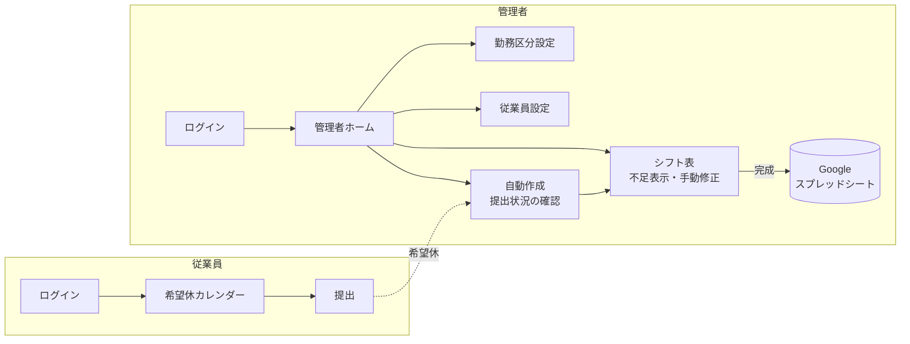
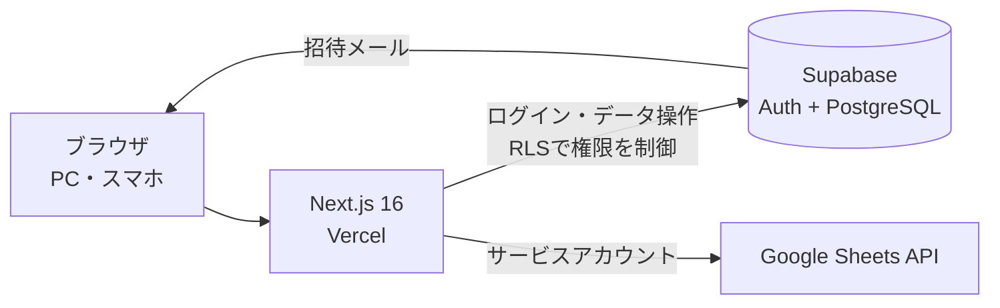
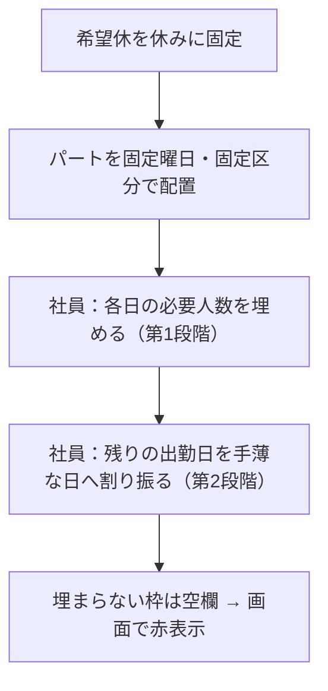

# 介護施設向け 自動シフト作成アプリ

従業員はスマホから希望休を提出し、管理者はボタンひとつで条件を満たすシフト案を作れる Web アプリです。
人員が足りない日は赤く表示されます。手で調整したシフトは、Google スプレッドシートに自動で保存されます。


---

## 解決したい課題

介護施設でシフトを作るときは、次の条件を**すべて同時に**満たす必要があります。管理者はこの作業に毎月多くの時間を取られています。

- 社員ごとの**月間休日数**
- パートの**固定の出勤曜日**
- **夜勤明け**の休み
- 一人ひとりの**希望休**
- 早番・夜勤などの**必要人数**

さらに、希望休は口頭や紙で集めることが多いため、誰がまだ提出していないのかが分かりにくいという問題もあります。

このアプリでは、**希望休の回収 → シフトの自動作成 → 人員不足の確認と手直し → 保存**までを、ひとつのアプリで行えるようにしました。

## 主な機能

### 従業員（スマホ対応）
| 機能 | 内容 |
|---|---|
| 希望休カレンダー | タップで休みたい日を選ぶ／解除する。提出したあとも更新できる |
| メッセージ | 「通院のため」など、管理者への補足を一緒に送れる |
| 招待制のログイン | 管理者が登録すると招待メールが届き、本人がパスワードを設定する |

### 管理者
| 機能 | 内容 |
|---|---|
| 提出状況 | スタッフ数・提出人数を表示し、**未提出者を黄色で強調**。希望休とメッセージを一覧で確認できる |
| シフト自動生成 | 従業員の条件・勤務区分・希望休から、1か月分のシフトをボタンひとつで作る |
| 人員不足の警告 | 必要人数に足りない日と勤務区分を**赤く表示** |
| 手動修正 | セルをタップして勤務区分や休みに変更できる。不足の表示もすぐに再計算される |
| スプレッドシート保存 | 「完成」を押すと、勤務区分の色付きで Google スプレッドシートに書き出す |
| 従業員設定 | 社員なら月間休日数、パートなら固定の出勤曜日と勤務区分を設定する |
| 勤務区分設定 | 早番・夜勤などの名前・色・時間・必要人数・**日またぎ**（翌日を自動で休みにする）を設定する |

## 画面の流れ



## システム構成



| 技術 | 使った理由 |
|---|---|
| **Next.js 16（App Router）** | 画面とサーバー処理（Server Actions）をひとつのプロジェクトで書け、秘密の鍵をブラウザに渡さずに済むため |
| **Supabase** | ログイン（招待メール含む）と PostgreSQL がまとめて使え、**RLS** でデータベース側から権限を制御できるため |
| **Google Sheets API** | 施設ではもともとスプレッドシートで印刷・共有していることが多く、運用を変えずに済むため |
| **Tailwind CSS** | スマホと PC の両方に対応した画面を手早く作れるため |

## 工夫した点

### 1. シフト自動生成アルゴリズム（[`src/lib/generate.ts`](src/lib/generate.ts)）

条件を満たしながら、**月末に人が足りなくならず、勤務区分の偏りも出ない**ように、処理を段階に分けました。



- **日をまたぐ勤務**（夜勤など）に入れたら、翌日を自動で休みにします。前月末が夜勤だった場合も、当月1日を休みにします
- 夜勤に入れる前に、「翌日が休みになっても、月間休日数を超えないか」を確認します
- 候補者は次の優先順位で選びます
  1. 休日を使い切っていて、残りの日はすべて出勤が必要な人
  2. その勤務区分に入った回数が少ない人（区分の偏りを防ぐ）
  3. 残りの出勤日数 ÷ 予定が空いている日数 が大きい人
- **改善の経緯**：最初の実装は、1日目から順番に「出勤するか休むか」を決めていました。この方法では月末に出勤日数を使い切る人が続出し、人員不足が起きていました。テスト用のデータで不足の発生箇所を調べ、「まず月全体で必要人数を埋め、余った出勤日はあとで割り振る」2段階の方式に作り直したところ、**不足が0**になりました
- **処理速度**：手元の検証では、スタッフ50名・1か月分を約0.1秒以内で生成できました（要件は10秒以内）

### 2. セキュリティ
- **RLS（行レベルセキュリティ）**：データベース側でアクセスを制限しています。従業員は自分の希望休しか読み書きできず、シフト表や他の人の情報は管理者だけが見られます（[`supabase/schema.sql`](supabase/schema.sql)）
- **強い権限の鍵はサーバーだけで使う**：招待メールの送信やユーザーの削除に使う Supabase のシークレットキーは `server-only` で守り、ブラウザに送られないようにしています
- **すべてのサーバー処理で権限を確認**：画面を経由しない直接の呼び出しにも備え、各処理の最初に管理者かどうかを確認しています。画面から送られてきたシフトのデータも、登録済みの従業員と勤務区分だけに絞ってから保存します
- **公開登録を受け付けない**：アカウントは管理者が招待した人だけが作れます

### 3. 現場で使いやすくする工夫
- 従業員の画面はスマホでの操作を前提にしました。大きなタップ領域と、1画面で完結する作りにしています
- シフト表では、**希望休を出した日に印**を付けました。管理者が手で直すときに、希望を見落とさないようにするためです
- セルを変更すると、不足人数と赤い表示が**その場で再計算**されます
- スプレッドシートへの書き出しでは、勤務区分の色・不足の赤表示・見出し行と名前列の固定まで再現しました

## データベース設計

| テーブル | 内容 |
|---|---|
| `profiles` | 管理者・従業員のプロフィール。役割、社員／パート、月間休日数、固定出勤曜日など |
| `shift_types` | 勤務区分。名前、色、時間、必要人数、日またぎ |
| `day_off_requests` | 希望休。従業員 × 対象月 で1件。日付の一覧とメッセージ |
| `shift_schedules` | 月ごとのシフト表（JSON 形式）。下書き／完成の状態とスプレッドシートの URL |

## ディレクトリ構成

```
src/
├── app/
│   ├── login/ , admin/login/     … ログイン画面（従業員／管理者）
│   ├── employee/                 … 従業員の希望休画面と提出処理
│   ├── admin/(main)/             … 管理者の各画面（ホーム・自動作成・シフト表・設定）
│   ├── admin/actions.ts          … 管理者のサーバー処理（Server Actions）
│   └── auth/                     … 招待メールからのパスワード設定
├── components/                   … 画面の部品（シフト表・カレンダー・フォームなど）
├── lib/
│   ├── generate.ts               … シフト自動生成アルゴリズム
│   ├── sheets.ts                 … Google スプレッドシートへの書き出し
│   └── supabase/                 … Supabase クライアント（サーバー／ブラウザ／管理用）
└── proxy.ts                      … ログイン状態の自動更新（Next.js 16 の proxy）
supabase/schema.sql               … テーブル定義と RLS
```

## 動かし方

```bash
npm install
cp .env.example .env.local   # Supabase と Google の値を設定
npm run dev
```

Supabase と Google Cloud の準備を含む詳しい手順は、[docs/setup.md](docs/setup.md) にまとめています。

## 今後の改善予定

- [ ] パスワード再設定の機能
- [ ] 管理者を画面から追加できるようにする
- [ ] 希望休の提出締切
- [ ] 自動生成アルゴリズムの自動テスト（単体テスト）
- [ ] 資格（介護福祉士など）を考慮した配置

## 開発について

- [要件定義書](requirements.md)の作成から始め、MVP（必要最小限の機能）として全19機能を実装しました
- 開発には AI コーディングアシスタントの **Claude Code** を活用しました。要件の整理、テストデータでのアルゴリズム検証、外部サービスとの接続確認を、AI と対話しながら進めています

## 作者

坪井聖奈 — [GitHub](https://github.com/tyz8gmtwm8-sudo)
